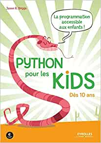
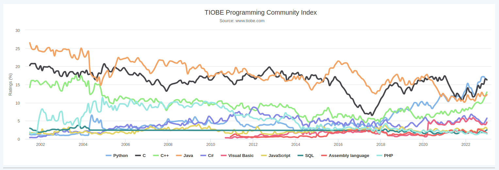

# Data-Based Economics

## Introduction

---

### General

- Your instructors:
  - Pablo Winant: `pwinant@escp.eu` (course and tutorials)
  - Rayane: `rayane.hanifi@edu.escp.eu` (tutorials)
- Hint: start your mail subject by `[dbe]`
- All course material on *Nuvolos*
  - a datascience platform
  - you'll be able to keep a full backup afterwards
- Collaboration between students is strongly encouraged

---

## So what will we do ?

- Programming
- Econometrics / Machine Learning
- Talk about economics

---

### Data-based economics (1)

- Most economists use data all the time
  - to illustrate facts
  - for research purposes

---

### Data-based economics

In practice these are the tasks an economist needs to perform:

- <!-- .element: class="fragment" -->import data
- <!-- .element: class="fragment" -->clean the data
  - deal with heterogenous sources, missing data, abnormal observerations
  - super time consuming
  - we'll make this part easy for you
- <!-- .element: class="fragment" -->describe the data (statistics), visualize it
- <!-- .element: class="fragment" -->interpret it using a model
- <!-- .element: class="fragment" -->present results

---

---

## Econometrics

---

### Econometricks

- An art invented by economists: $$\underbrace{y}\_{\text{dependent variable}} = a \underbrace{x}\_{\text{explanatory variable}} + b$$

- Main hallenge:
  - given dataset $(x_i, y_i)$
  - find $a$ while *controlling* for $b$
  - understand robustness of results
  - predict new values of $y$ for new values of $x$

---

http://medialab.github.io/well-being-metrics/app/#/

---

## Econometricks (2)

$$\underbrace{y}\_{\text{dependent variable}} = a \underbrace{x}\_{\text{explanatory variable}} + b$$

- <!-- .element: class="fragment" --> Example 1:
  - I want to establish a link between growth and trade openness
  - <!-- .element: class="fragment" -->but my country has only 10 years of historical data... (within dimension)
  - <!-- .element: class="fragment" -->... let's take 50 countries at the same time (between dimension)
  - <!-- .element: class="fragment" -->find a way to analyze both dimensions at the same time
  - <!-- .element: class="fragment" -->-> panel data

---

## Econometricks (3)

$$\underbrace{y}\_{\text{dependent variable}} = a \underbrace{x}\_{\text{explanatory variable}} + b$$

- <!-- .element: class="fragment" --> Example 2:
  -  young men who go to war receive *in average* lower wages when they return than men who didn't go to war
  - <!-- .element: class="fragment" --> ... is it because they skipped college?
  -  <!-- .element: class="fragment" -->... or did they choose to go to war because they were less skilled for college?
  -  <!-- .element: class="fragment" -->find a way to extract *causality*
  -  <!-- .element: class="fragment" -->-> instrumental variables
  -  <!-- .element: class="fragment" -->This was worth a Nobel Prize! (D. Card, J. Angrist, G.W. Imbens)

---

## Big Data Era and Machine Learning

- Data has become very abundant
- <!-- .element: class="fragment" -->Large amounts of data of all kinds
  - structured (tables, ...)
  - unstructured (text, images, ...)
- <!-- .element: class="fragment" -->Machine learning:
  - a set of powerful algorithms...
  - ... so powerful some call it *artificial intelligence*
    - they *learn* by processing data
  - ... to extract information and relations in large data sets
  - ... 
- <!-- .element: class="fragment" -->Comparison with econometrics
  - ML has it own, partially redundant, jargon
  - much harder to understand causality, standard deviation (i.e. precision)

---

## Machine Learning

$$\underbrace{y}\_{\text{predicted variable}} = f( \underbrace{x}\_{\text{feature}} , a)$$

- Challenge:
  - given dataset $(x_i, y_i)$
  - find $a$, that is find a nonlinear relationship between $a$ and $b$
  - predict new values of $y$ given new values of $x$

- What are the difference with econometrics?

---

## Big Data Era and Machine Learning (1)

Deep learning: artificial neural nets

---

## Big Data Era and Machine Learning (2)

Sentiment analysis: predict population's optimism by analyzing tweets.

Check [sentiment viz](https://www.csc2.ncsu.edu/faculty/healey/tweet_viz/tweet_app/)

---

## Why program in Python?

- Why learn Python?
- And not <!-- .element: class="fragment" -->
  - R
  - SPSS
  - Stata
  - Matlab
  - C
  - Javascript
  - SQL

---

## Because

Python is:

  

     Easy
  

  

     Free
  

  

  
   

  Popular ([TIOBE Index](https://www.tiobe.com/tiobe-index/))
  

  

   
  
  
  

  
  - The lingua Franca of Machine learning
    - All major machine learning are written or interface with Python

  

---

---

## Why Should you learn programming ?

- <!-- .element: class="fragment" -->Researchers (econometricians or data scientists) spend 80% of their time writing code.
- <!-- .element: class="fragment" -->Presentation (plots, interactive apps) is key and relies on
  - ... programming
-  <!-- .element: class="fragment" -->Interaction with code becomes unavoidable in business environment
  - fixing the website
  - querying the database
  - ...
- <!-- .element: class="fragment" -->Worth investing a  bit of time to learn it
  - you can easily become an __expert__
- <!-- .element: class="fragment" -->Plus it's fun

---

## Programming

## How good should you program ?

  

    
  A  

    
  B  

    
  C  

    
  D  

    
  E  

  

  

  

  - <!-- .element: class="fragment" data-fragment-index="1" -->We will "assume" everybody as some prior experience with Python
  - <!-- .element: class="fragment" data-fragment-index="2"-->Even though some of you have possibly never touched it
  - <!-- .element: class="fragment" data-fragment-index="3"-->We'll do some catchup today
  - <!-- .element: class="fragment" data-fragment-index="4"-->And count on you to find the resources to learn what you need when you need it
  - <!-- .element: class="fragment" data-fragment-index="5" -->Of course you can always ask questions

  

---

## Additional resources

Plenty of online resources to learn python/econometrics/machine learning

- [learnpython](learnpython.org) sponsored by [datacamp](https://www.datacamp.com/)
- [quantecon](https://datascience.quantecon.org/): designed for economists, good examples of projects
- [Python Data Science Handbook](https://jakevdp.github.io/PythonDataScienceHandbook/): by Jake Van der Plas, very complete. Online free version.
- [Introduction to Econometrics with R](https://scpoecon.github.io/ScPoEconometrics/), in R but very clear (beginner and advanced versions)

---

## Quantecon

  

  

    

     
    Tom Sargent
    

    

     
    John Stachurski
    

  

  

  

    Tom Sargent @ ESCP  
    
  

 

- __Quantecon__: free online [lectures](https://quantecon.org/lectures/) to learn python programming and (advanced) economics
  - now with a section on [datascience](https://datascience.quantecon.org/)
  - it is excellent!

---

## Litterate Programming