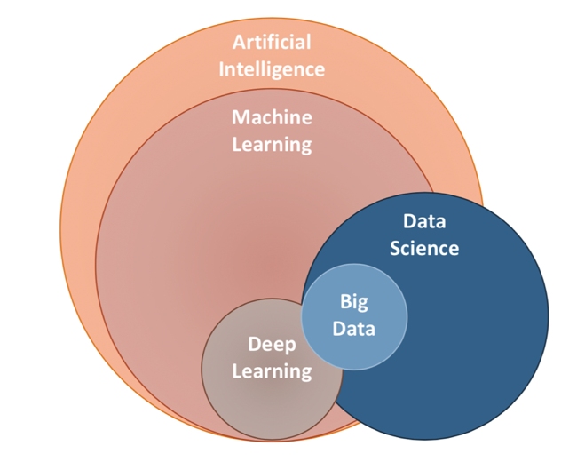
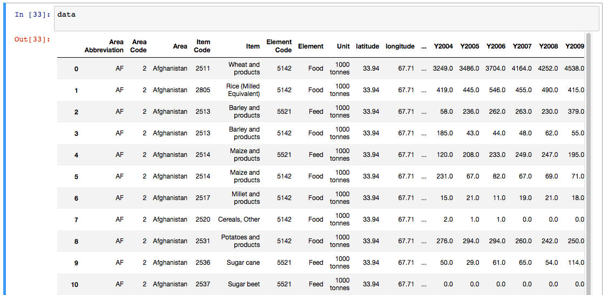
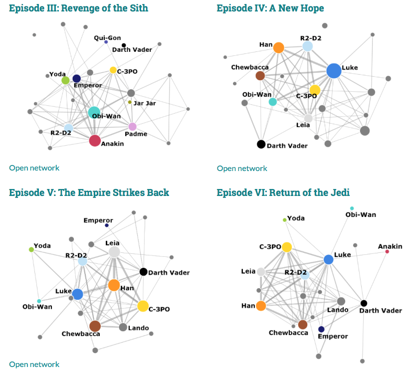
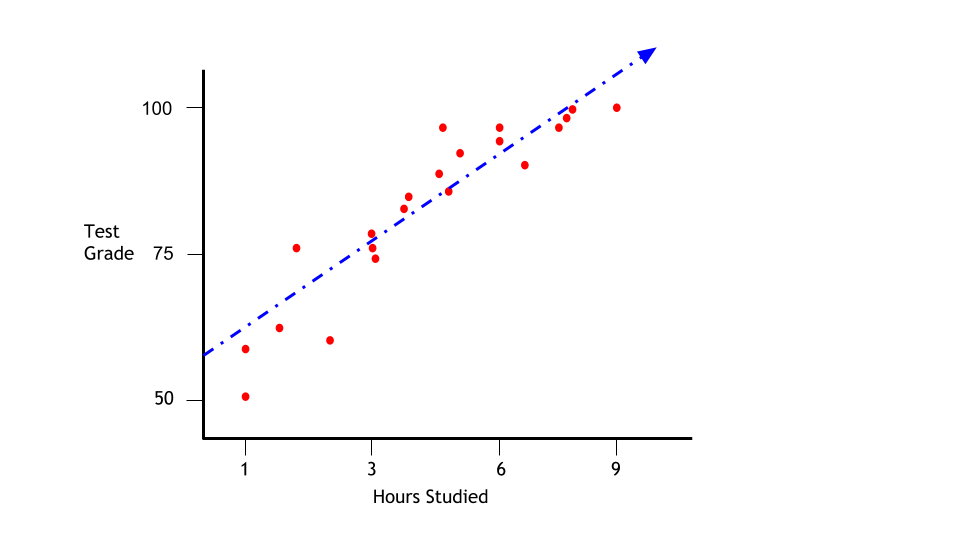
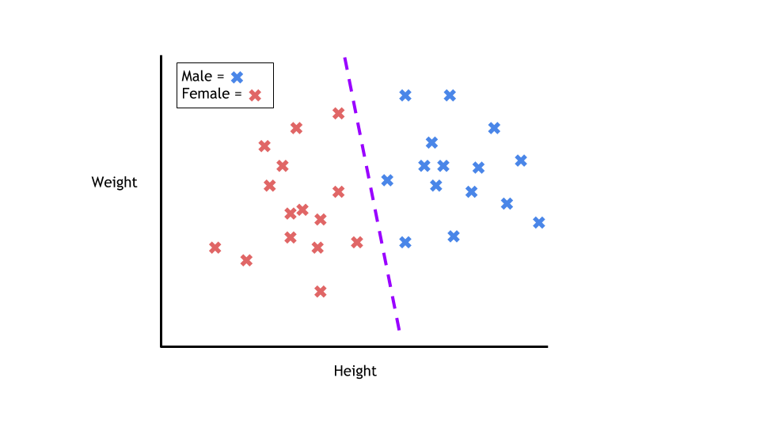
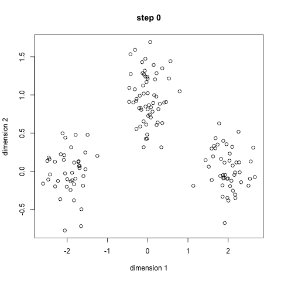
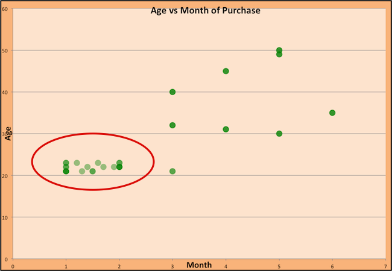
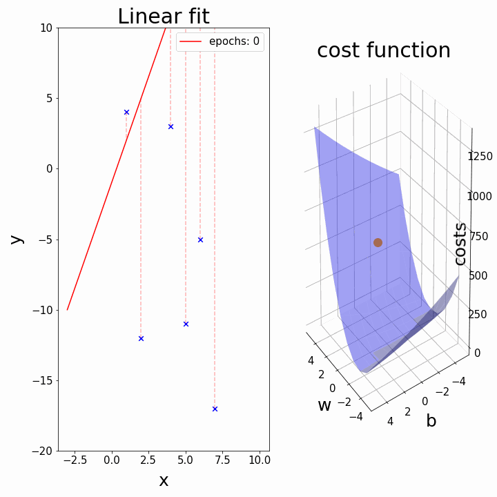
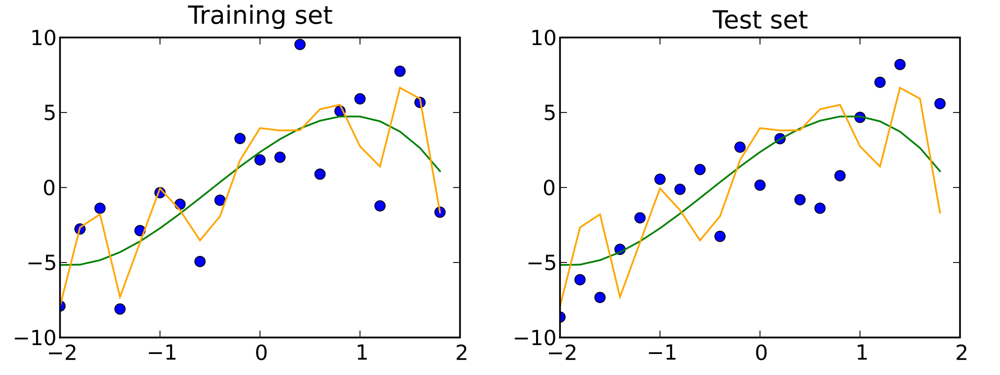

# Machine Learning (1)

## Regressions

---

## What is machine learning?

----

### What is Machine learning?

Definition Candidates:

Arthur Samuel: *Field of study that gives computers the ability to learn without being explicitly programmed*

Tom Mitchell: *A computer program is said to learn from experience E with respect to some class of tasks T and performance measure P if its performance at tasks in T, as measured by P, improves with experience E.*

----

### What about artificial intelligence ?

<div class="container">

<div class="col">

- AIs
  - think and learn
  - mimmic human cognition
</div>

<div class="col">



</div>

</div>

----

### Econometrics vs Machine Learning

- Econometrics is essentially a subfield of machine learning with a different jargon and a focus on:
  - studying properties and validity of results
      - data is scarce
      - inference
  - singling out effects of specific explanatory variables
  - establishing causality

- Machine learning:
  - structure data
  - make predictions (interpolate data)


---

## Big Data

----

### Data types

- structured:
    - tabular
      - long
      - wide
- unstructured:
    - files
    - networks
    - text, mails
    - images, sound

----

### Tabular Data



----

### Networks

- Banking networks
- Production network



----

### Big Data

- __Big__ data:
  - wide data (K>>N)
  - long data (N>>K)
  - heterogenous, unstructured data
- Might not even fit in memory
  - out of core computations
  - learn from a subset of the data


---

## Machine Learning Tasks

----

### Big subfields of Machine Learning

<div class="container">

<div class="col">

- Traditional classification
    - supervised (<mark>labelled</mark> data)
        - regression: predict quantity
        - classification: predict index (categorical variable)
    - unsupervised (no labels)
        - dimension reduction
        - clustering
    - semi-supervised / self-supervised
    - reinforcement learning
- Bazillions of different algorithms: https://scikit-learn.org/stable/user_guide.html

</div>
<div class="col">

<div class="r-stack">


<table class="fragment current-visible">
<tr>
<th>Age</th>
<th>Activity</th>
<th><mark>Salary</mark></th>
</tr>
<tr>
<td>23</td>
<td>Explorer</td>
<td>1200</td>
</tr>
<tr>
<td>40</td>
<td>Mortician</td>
<td>2000</td>
</tr>
<tr>
<td>45</td>
<td>Mortician</td>
<td>2500</td>
</tr>
<tr>
<td>33</td>
<td>Movie Star</td>
<td>3000</td>
</tr>
<tr>
<td>35</td>
<td>Explorer</td>
<td>???</td>
</tr>
</table>

<div class="fragment current-visible">


__supervised: regression__



- Predict: $y = f(x; \theta)$

</div>


<table class="fragment current-visible">
<tr>
<th>Age</th>
<th>Salary</th>
<th><mark>Activity</mark></th>
</tr>
<tr>
<td>23</td>
<td>1200</td>
<td>Explorer</td>
</tr>
<tr>
<td>40</td>
<td>2000</td>
<td>Mortician</td>
</tr>
<tr>
<td>45</td>
<td>2500</td>
<td>Mortician</td>
</tr>
<tr>
<td>33</td>
<td>3000</td>
<td>Movie Star</td>
</tr>
<tr>
<td>35</td>
<td>3000</td>
<td>???</td>
</tr>
</table>

<div class="fragment current-visible">

__supervised: classification__



- Output is discrete
- Regular trick: $\sigma(f(x; \theta))$ where $\sigma(x)=\frac{1}{1-e^{-x}}$

</div>


<table class="fragment current-visible">
<tr>
<th>Age</th>
<th>Salary</th>
<th>Activity</th>
</tr>
<tr>
<td>23</td>
<td>1200</td>
<td>Explorer</td>
</tr>
<tr>
<td>40</td>
<td>2000</td>
<td>Mortician</td>
</tr>
<tr>
<td>45</td>
<td>2500</td>
<td>Mortician</td>
</tr>
<tr>
<td>33</td>
<td>3000</td>
<td>Movie Star</td>
</tr>
<tr>
<td>35</td>
<td>3000</td>
<td>Explorer</td>
</tr>
</table>

<div class="fragment current-visible">

__unsupervised__

- organize data without labels
    - dimension reduction: describe data with less parameters
    - clustering: sort data into "similar groups" ([exemple](https://scikit-learn.org/stable/auto_examples/cluster/plot_cluster_comparison.html))

</div>

<div class="fragment current-visible">

__unsupervised: clustering__




</div>

<div class="fragment current-visible">

__unsupervised: clustering__

Women buying desses during the year:



</div>

</div>

----

## Difference with traditional regression

$$\underbrace{y}\_{\text{explained variable}} = a \underbrace{x}\_{\text{explanatory variable}} + b$$

| Econometrics                       |  Machine learning  | 
|------------------------------------|--------------------|
| Regressand / independent variable / explanatory variable  |  Features          | 
| Regressor / dependent variable / explained variable    |  Labels            |
| Regression                         |  Model Training    |


----

## Difference with traditional regression


- Big data requires other means to process the data:
    - data is long: so many observations $x$ doesn't fit in the memory
        - need to use incremental training method to use only a subsample at a time
    - data is wide: so many features, the model is crudely overspecified
        - need to build dimension reduction into the objective
    - data is nonlinear: 
        - use nonlinear model (and nonlinear training)
    - data is not a simple vector...
        - same as nonlinear

---

## Regression with long data

----

### Long data

- We've got *a lot* of data.
- Sometimes in doesn't fit in the computer memory so we can't run a basic regression
- Sometimes, we would like to update our model continuously:
  - incremental regression

----

### Long data
    
- Traditional regression:
    - full sample $X,Y=(x_i,y_i)_{i=1:N}$
    - OLS: $\min_{a,b} \sum_{i=1}^N (a x_i + b - y_i)^2$
    - closed-form solution: $a = X^{\prime}X Y$ and $b= ...$
    - hard to compute if $X$ is very big
- Incremental learning:
    - given initial $a_0$, $b_0$
    - pick $B$ random observations, regress them to get new estimate $a$, $b$
      - this minimizes the square of errors
    - update with learning rate $\beta$:
      -  $a_1 \leftarrow a_0 (1-\beta) + \beta a $
      -  $b_1 \leftarrow b_0 (1-\beta) + \beta b $
    - process is not biased (that is $a$ converges to the true value) as long as one decreases $\beta$ sufficiently fast over time

----

### Formalisation

- vector of unknowns: $\theta=(a,b)$
- dataset $X,Y=(x_i,y_i)_{i=1:N}$
- for a random draw $\omega = (a\_{\sigma(i)}, b\_{\sigma(i)})\_{i=[1,B]} \subset (X,Y)$
  - $\omega$ is just a random __batch__ of size $B$
- define the *empirical* risk (or empirical *cost*)
  $$\xi(\theta, \omega) = \sum_{(x,y) \in \omega} (y - (a x + b))^2$$
- we want to minimize *theoretical risk*:
  $$\Xi(\theta) = \mathbb{E} \left[ \xi(\theta, \omega)\right]$$

----


### Training: Gradient Descent

<div class="container">

<div class="col">

- How do we minimize a function $f(a,b)$?

- Gradient descent:
  - $a_k, b_k$ given
  - compute the gradient (slope) $\nabla_{a,b} f = \begin{bmatrix} \frac{\partial f}{\partial a} \\\\ \frac{\partial f}{\partial b}\end{bmatrix}$
  - follow the steepest slope: (Newton Algorithm)
    - $$ \begin{bmatrix} a_{k+1} \\\\ b_{k+1} \end{bmatrix} \leftarrow  \begin{bmatrix} a_k \\\\ b_k \end{bmatrix} - \nabla_{a,b} f$$
  - but not too fast: use learning rate $\lambda$:
   $$ \begin{bmatrix} a_{k+1} \\\\ b_{k+1} \end{bmatrix} \leftarrow  (1-\lambda) \begin{bmatrix} a_k \\\\ b_k \end{bmatrix} + \lambda (- \nabla_{a,b} f )$$


</div>

<div class="col">

 

</div>

</div>

----

### Not everything goes wrong all the time


- In practice, choosing the right learning rate $\lambda$ is crucial
- $\lambda$ is a __metaparameter__ of the model training.

----

### Stochastic Gradient Descent

- Stochastic gradient descent
  - As long as the batch is taken randomly
  - As long as the learning rate is small enough
  - Or the batch size big enough
  - The gradient is *unbiased* (i.e. $\mathbb{E}\left[ \nabla \xi(\omega, \theta) \right] = \nabla \Xi(\theta)$)
- We don't need the whole dataset.

---

## Regression with wide data

----

## Wide data AI approach to Machine Learning

- Problem:
  - there are many independent variables $x_1, ... x_K$, $K>>N$ and one dependent variable.
  - $y = a_1 x_1 + a_2 x_2 + \cdots + a_N x_N + b$ is grossly overidentified.

- Idea: penalize non-zero coefficients to encourage scarcity
  - Ridge: $\Xi(a,b) = \min_{a,b} \sum_{i=1}^N ( \sum_j a_j x_j + b - y_i)^2 + \mu \sum_i |a_i|^2$
    - shrinks parameters towards zero
    - closed form
  - Lasso: $\Xi(a,b) = \min_{a,b} \sum_{i=1}^N (\sum_j a_j x_j + b - y_i)^2 + \mu \sum_i |a_i|$
    - eliminates zero coefficients
  - Elastic: Ridge + Lasso

- Remarks:
  - AI approach: minimize objective directly.
  - $\mu$ is called a regularization term.
    - $\mu \uparrow$, bias increases, variance decreases

----

### Training

- Lasso and ridge regression can be trained using Gradient Descent
- Or obtained using special algorithms

----

### Example: IMF challenge

- An internal IMF challenge to predict crises in countries
- Lots of different approaches
- Lots of data:
  - which one is relevant
  - machine must select relevant informations
- Example: *Lasso Regressions and Forecasting Models in Applied Stress Testing* by Jorge A. Chan-Lau
  - in a given developing country
  - tries to predict probability of default in various sectors

---

## Nonlinear Regression

----

### Nonlinear Regression

- So far, we have assumed, 
  - $y_i = a + b x_i$
  - $y_i = a + b x_i + μ_1 (a^2 + b^2) + μ_1 (|a| + |b|)$
  - defined $\Xi(a,b)$ and tried to minimize it
- Same approach works for fully nonlinear models
  - $y_i = a x_i + a^2 x_i^2 + c$
  - $y_i = \varphi(x; \theta)$ ()
- Special case: neural network:
  - primer [tensor playground](https://playground.tensorflow.org/#activation=tanh&batchSize=10&dataset=circle&regDataset=reg-plane&learningRate=0.03&regularizationRate=0&noise=0&networkShape=4,2&seed=0.85189&showTestData=false&discretize=false&percTrainData=50&x=true&y=true&xTimesY=false&xSquared=false&ySquared=false&cosX=false&sinX=false&cosY=false&sinY=false&collectStats=false&problem=classification&initZero=false&hideText=false)

---

## Model validation

----

## how to evaluate the machine learning

- Basic idea (independent of how complex the algorithm is)
  - separate data in
    - training set (in-sample)
    - test set (out of sample)
  - train using only the training set
  - evaluate performance on the test set
- Performance can be:
  - fitness, number of classification errors (false positive, false negative)
- If many training parameters are used (the hyperparameters)
  - training set (in-sample)
  - validation set (to update hyperparameters)
  - test set (out of sample)

Rule: the model and the hyperparameters should be chosen _independently from the test set_.

----

## How to judge a model validity?

- not easy
- modeling *asumptions* (specification):
    - functional space -> fit, variance (econ: $R^2$)
    - statistical modeling: data generating process -> bias (econ: stdev)
- There is a very general _tradeoff bias/variance_
- Many ML methods allow to estimate bias (possibly via bootstrapping)

----



----

### How to choose the validation set?

- Holdout validation approach: keeps x% of the data for the training, (100-x)% for the test
  - small dataset: 90-10
  - big data set: 70-30 (we can afford to waste more training data for the test)

- Problem: are we sure the validation size is correct? Are the results determined by an (un-) lucky draw ?

<div class="container">
<div class="col">

- Solution: $k$-fold validation
  - split dataset randomly in $K$ subsets of equal size $S_1, ... S_K$
  - use subset $S_i$ as test set, the rest as training set, compute the score
  - compare the scores obtained for all $i\in[1,K]$
    - average them

</div>
<div class="col">


</div>
</div>


---

## How to use sklearn for regressions


----

### Wait

- *Another* library to do regression ?

- `statsmodels`: 
  - explanatory analysis
  - statistical tests
  - formula interface for many estimation algorithms
    - stateless approach (`model.fit()` returns another object)

- `linearmodels`
  - *extends* `statsmodels` (very similar interface)
    - (panel models, IV, systems...)

- `sklearn`: 
  - prediction
  - faster for big datasets
  - common interface for several machine learning tasks
    - stateful approach (model is modified by `.fit` operation)

----

### Basic sklearn workflow


<div class="container">

<div class="col">


- Workflow
  - <!-- .element class="fragment" data-fragment-index="1" --> import data
    - features: a matrix X (2d numpy array)
    - labels: a vector y (1d numpy array)
  - <!-- .element class="fragment" data-fragment-index="2" --> split the data, between training and test datasets
    - split needs to be random to avoid any bias
  - <!-- .element class="fragment" data-fragment-index="3" --> normalize the data
    - most ML algorithm are sensitive to scale

  - <!-- .element class="fragment" data-fragment-index="4" --> create a model (independent from data)
  - <!-- .element class="fragment" data-fragment-index="5" --> train the model on training dataset
  - <!-- .element class="fragment" data-fragment-index="6" --> evaluate accuracy on test dataset (here $R^2$)
  - <!-- .element class="fragment" data-fragment-index="7" -->use the model to make predictions
- <!-- .element class="fragment" data-fragment-index="8" --> The workflow is always the same, no matter what the model is
  - try  `sklearn.linear_model.Lasso` instead of `LinearRegression`


</div>

<div class="col">

<div class="fragment" data-fragment-index=1>

```python
from sklearn.datasets import load_diabetes
dataset = load_diabetes()
X = dataset['data']
y = dataset['target']
```

</div>


<div class="fragment" data-fragment-index=2>

```python
from sklearn.model_selection import train_test_split
X_train, X_test, y_train, y_test = train_test_split(X,y, test_size=0.1)
```

</div>


<div class="fragment" data-fragment-index=3>

```python
#Feature Scaling
from sklearn.preprocessing import StandardScaler
sc = StandardScaler()
X_train = sc.fit_transform(X_train)
X_test = sc.transform(X_test)
```

</div>

<div class="fragment" data-fragment-index=4>

```python
from sklearn.linear_model import LinearRegression
model = LinearRegression()
```

</div>

<div class="fragment" data-fragment-index=5>

```python
model.fit(X_train, y_train)
```

</div>

<div class="fragment" data-fragment-index=6>

```python
model.score(X_test, y_test)
```

</div>

<div class="fragment" data-fragment-index=7>

```python
model.predict(X_new)
```

</div>

</div>

</div>


----

### How to implement $k$-fold validation with sklearn


```python

from sklearn.model_selection import KFold
kf = KFold(n_splits=10)

for train_index, test_index in kf.split(X):
   X_train, X_test = X[train_index], X[test_index]
   y_train, y_test = y[train_index], y[test_index]

   ## train a model in X_train, y_train
   ## test it on X_test, y_test

```
