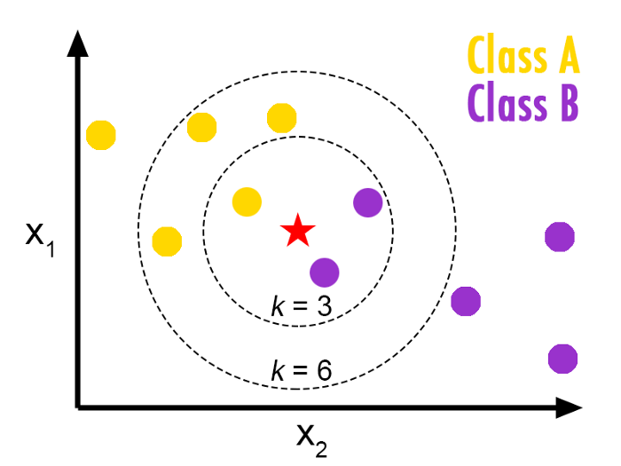
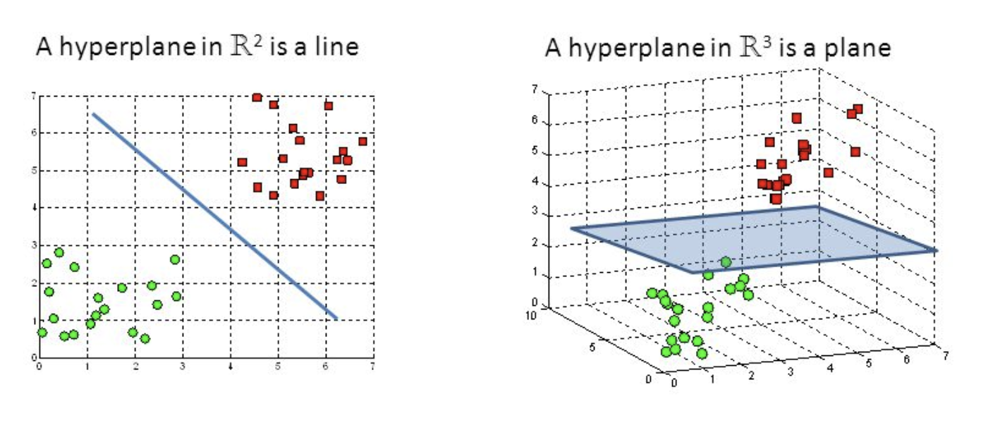
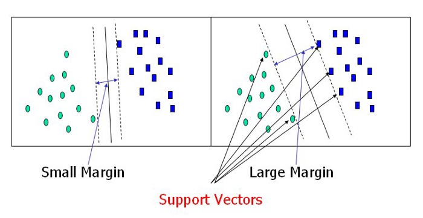

# Machine learning (2)

---

## How to use sklearn for regressions


----

### Wait

- *Another* library to do regression ?

- `statsmodels`: 
  - explanatory analysis
  - statistical tests
  - formula interface for many estimation algorithms
    - stateless approach (`model.fit()` returns another object)

- `linearmodels`
  - *extends* `statsmodels` (very similar interface)
    - (panel models, IV, systems...)

- `sklearn`: 
  - prediction
  - faster for big datasets
  - common interface for several machine learning tasks
    - stateful approach (model is modified by `.fit` operation)

----

### Basic sklearn workflow


<div class="container">

<div class="col">


- Workflow
  - <!-- .element class="fragment" data-fragment-index="1" --> import data
    - features: a matrix X (2d numpy array)
    - labels: a vector y (1d numpy array)
  - <!-- .element class="fragment" data-fragment-index="2" --> split the data, between training and test datasets
    - split needs to be random to avoid any bias
  - <!-- .element class="fragment" data-fragment-index="3" --> normalize the data
    - most ML algorithm are sensitive to scale

  - <!-- .element class="fragment" data-fragment-index="4" --> create a model (independent from data)
  - <!-- .element class="fragment" data-fragment-index="5" --> train the model on training dataset
  - <!-- .element class="fragment" data-fragment-index="6" --> evaluate accuracy on test dataset (here $R^2$)
  - <!-- .element class="fragment" data-fragment-index="7" -->use the model to make predictions
- <!-- .element class="fragment" data-fragment-index="8" --> The workflow is always the same, no matter what the model is
  - try to run the code


</div>

<div class="col">

<div class="fragment" data-fragment-index=1>

```python
from sklearn.datasets import load_diabetes
dataset = load_diabetes()
X = dataset['data']
y = dataset['target']
```

</div>


<div class="fragment" data-fragment-index=2>

```python
from sklearn.model_selection import train_test_split
X_train, X_test, y_train, y_test = train_test_split(X,y, test_size=0.1)
```

</div>


<div class="fragment" data-fragment-index=3>

```python
#Feature Scaling
from sklearn.preprocessing import StandardScaler
sc = StandardScaler()
X_train = sc.fit_transform(X_train)
X_test = sc.transform(X_test)
```

</div>

<div class="fragment" data-fragment-index=4>

```python
from sklearn.linear_model import LinearRegression
model = LinearRegression()
```

</div>

<div class="fragment" data-fragment-index=5>

```python
model.fit(X_train, y_train)
```

</div>

<div class="fragment" data-fragment-index=6>

```python
model.score(X_test, y_test)
```

</div>

<div class="fragment" data-fragment-index=7>

```python
model.predict(X_new)
```

</div>

</div>

</div>

---

## Classification Problems 

----

### Classification problem

- Binary Classification 
  - Goal is to make a *prediction* $c_n = f(x_{1,1}, ... x_{k,n})$ ...
  - ...where $c_i$ is a binary variable ($\in\{0,1\}$)
  - ... and $(x_{i,n})_k$, $k$ different features to predict $c_n$
- Multicategory Classification
  - The variable to predict takes values in a non ordered set with $p$ different values

----

### Logistic regression

<div class="container">

<div class="col">

- Given a regression model (a linear predictor)

$$ a_0 + a_1 x_1 + a_2 x_2 + \cdots a_n x_n $$
- one can build a classification model:
$$ f(x_1, ..., x_n) = \sigma( a_0 + a_1 x_1 + a_2 x_2 + \cdots a_n x_n )$$
where $\sigma(x)=\frac{1}{1+\exp(-x)}$ is the logistic function a.k.a. sigmoid 
- The loss function to minimize is:
$$L() = \sum_n (c_n - \sigma( a_{0} + a_1 x_{1,n} + a_2 x_{2,n} + \cdots a_k x_{k,n} ) )^2$$
- This works for any regression model (LASSO, RIDGE, nonlinear...)
</div>

<div class="col">


</div>

</div>

----

### Logistic regression

- The linear model predicts an intensity/score (not a category)
$$ f(x_1, ..., x_n) = \sigma( \underbrace{a_0 + a_1 x_1 + a_2 x_2 + \cdots a_n x_n }_{\text{score}})$$
- To make a prediction: round to 0 or 1.


----

### Multinomial regression

- If there are $P$ categories to predict:
  - build a linear predictor $f_p$ for each category $p$
  - linear predictor is also called score

- To predict:
  - evaluate the score of all categories
  - choose the one with highest score

- To train the model:
  - train separately all scores (works for any predictor, not just linear)
  - ... there are more subtle approaches (not here)


---

## Other Classifiers

----

### Common classification algorithms

There are many 
- Logistic Regression
- Naive Bayes Classifier 
- Nearest Distance
- neural networks (replace score in sigmoid by n.n.)
- Decision Trees
- Support Vector Machines

----

### Nearest distance

<dic class="container">

<div class="col">

- Idea: 
  - in order to predict category $c$ corresponding to $x$ find the closest point $x_0$ in the training set 
  - Assign to $x$ the same category as $x_0$
- But this would be very susceptible to noise
- Amended idea: $k-nearest$ neighbours
  - look for the $k$ points closest to $x$
  - label $x$ with the same category as the majority of them
- Remark: this algorithm uses Euclidean distance. This is why it is important to normalize the dataset.

</div>

<div class="col">



</div>

</div>

----

### Decision Tree / Random Forests

<dic class="container">

<div class="col">

- Decision Tree
    - recursively find simple criteria to subdivide dataset

- Problems: 
  - Greedy: algorithm does not simplify branches
  - easily overfits

- Extension : random tree forest 
  - uses several (randomly generated) trees to generate a prediction
  - solves the overfitting problem
</div>

<div class="col">


</div>

</div>

----

### Support Vector Classification

<div class="container">

<div class="col">

- <!-- .element: class="fragment" data-fragment-index="1" --> Separates data by one line (hyperplane).
- <!-- .element: class="fragment" data-fragment-index="2" --> Chooses the largest margin according to <emph>support vectors</emph>
- <!-- .element: class="fragment" data-fragment-index="3" --> Can use a nonlinear kernel.

</div>

<div class="col">

<div class="r-stack">





</div>

</div>
</div>

----

### All these algorithms are super duper easy to use!


```python
from sklearn.tree import DecisionTreeClassifier
clf = DecisionTreeClassifier(random_state=0)
```

...

```python
from sklearn.svm import SVC
clf = SVC(random_state=0)
```

...

```python
from sklearn.linear_model import Ridge
clf = Ridge(random_state=0)
```


---

## Validation

----

### Validity of a classification algorithm

- Independently of how the classification is made, its validity can be assessed with a similar procedure as in the regression.

- Separate training set and test set
  - do not touch test set at all during the training

- Compute score: number of correctly identified categories
  - note that this is not the same as the loss function minimized by the training


----

### Classification matrix

- For binary classification, we focus on the *classification matrix* or *confusion matrix*.
| Predicted | (0) Actual      | (1) Actual      |
| --------- | --------------- | --------------- |
| 0         | true negatives (TN) | false negatives (FN) |
| 1         | false positives  (FP) | true positives (TP) |

- Overall accuracy: $\frac{\text{TN}+\text{TP}}{\text{total}}$
- Sensitivity: $\frac{TP}{FP+TP}$
- False Positive Rate (FPR): $\frac{FP}{TN+FP}$

- In some cases, sensitivity is the actual objective, at the expense of lower FPR
  - example: fraud detection
- Example:
    -  facial recognition by London police: 2% accuracy
    -  facial recognition by South Wales police: 9% accuracy
    -  a success?

----

### Confusion matrix with sklearn

- Predict on the test set:

```python
y_pred = model.predict(x_test)
```
- Compute confusion matrix:

```python
from sklearn.metrics import confusion_matrix
cm = confusion_matrix(y_test, y_pred)
```

----

### How to choose the validation set?

- Holdout validation approach: keeps x% of the data for the training, (100-x)% for the test
  - small dataset: 90-10
  - big data set: 70-30 (we can afford to waste more training data for the test)

- Problem: are we sure the validation size is correct? Are the results determined by an (un-) lucky draw ?

<div class="container">
<div class="col">

- Solution: $k$-fold validation
  - split dataset randomly in $K$ subsets of equal size $S_1, ... S_K$
  - use subset $S_i$ as test set, the rest as training set, compute the score
  - compare the scores obtained for all $i\in[1,K]$
    - average them

</div>
<div class="col">


</div>
</div>


----

### How to implement $k$-fold validation with sklearn


```python

from sklearn.model_selection import KFold
kf = KFold(n_splits=10)

for train_index, test_index in kf.split(X):
   X_train, X_test = X[train_index], X[test_index]
   y_train, y_test = y[train_index], y[test_index]

   ## train a model in X_train, y_train
   ## test it on X_test, y_test

```