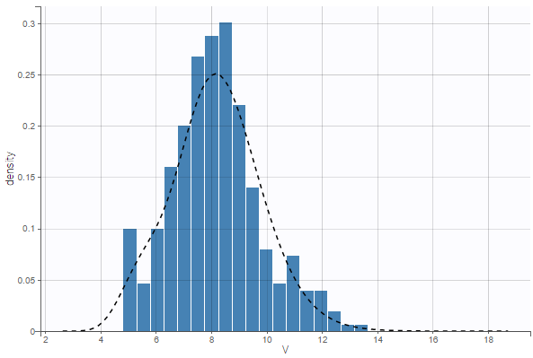
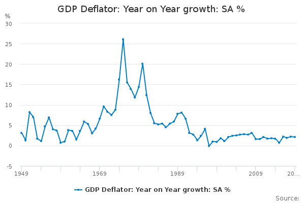
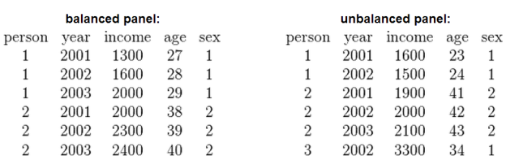
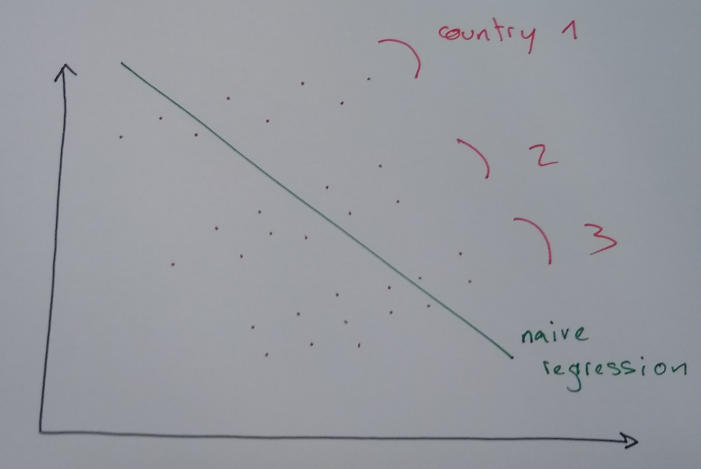
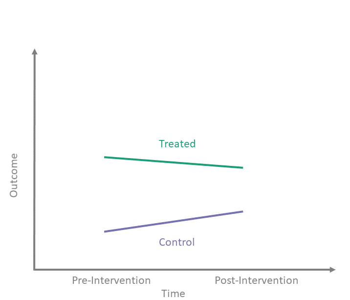

# Panels

---

##  Time and space

----

### Time and Space

- Until now, we have been rather loose about where the data comes from:
- Trying to explain $N$ observations: $y_n = a + b x_n, n\in [1,N]$

- All these lonely observations, where do they all come from?

<div class="container">

<div class="col">

Individuals: cross section



</div>

<div class="col">

Dates: time-series



</div>

</div>

----

### Time Series


- very simple study: structural break
  - does regression on $[T_1, \overline{T}]$ yield (significantly) different results on $[\overline{T}, T_2]$
- going further: *time series analysis*
  - data is typically autocorrelated
  - example (AR1) $x_t = a  + b x_{t-1} + \epsilon_t$

----

### Longitudinal Data / Panel Data

<div class="container">

<div class="col">

<div class="r-stack">

<div class="fragment current-visible" data-fragment-index=1 >

- Repeated cross sectional studies
- Index individual by $i\in [1,J]$ and time by $t\in[1,T]$
[graph repeated cross-sectional]
- we can study evolution of the regression over time
  $$\text{date 1}: y_{i,1} = a_1 + b_1 x_{1,1}$$
  ...
  $$\text{date t}: y_{i,t} = a_i + b_i x_{i,1}$$
  ...
  $$\text{date T}: y_{i,T} = a_T + b_T x_{i,T}$$

- $y_{i,t}$ and $y_{i,t+1}$ are unrelated
- One big regression: *pooled* regression.

</div>

<div class="fragment" data-fragment-index=2>

- Even better: longitudinal data

  - [graph longitudinal data]

- The same individuals are followed over time.
- We can study the evolution of individuals while taking into account their heterogeneity


</div>

</div>

</div>
<div class="col">
<div class="r-stack">


</div>
</div>
</div>

----

### Balanced vs Unbalanced

<div class="container">

<div class="col">

- Balanced: all individuals in the sample are followed from 1 to T
- Unbalanced: some indivuduals start later, stop earlier




</div>
<div class="col">

- <!-- .element class="fragment" -->Crude solutions:
  - truncate the dates between $[T_1, T_2]$ so that dataset is balanced
  - eliminate individuals who are not present in the full sample
- <!-- .element class="fragment" -->Not very good:
  - can limit a lot the size of the sample
  - can induce a "selection bias"
- <!-- .element class="fragment" -->Real gurus know how to deal with missing values
  - many algorithms can be adapted
</div>

----

### Long and wide format


- we tend to prefer here the long format (w.r.t id and date)
- there can be many columns though (for each variable)


----

### Micro-Panel vs Macro-Panel


- __micro-panel__: $T<<N$
  - Panel Study of Income Dynamics (PSID): 5000 consumers since 1967 (US)
    - reinterview same individuals from year to year
    - but some go in/out of the panel
  - Survey of Consumer and Finance (SCF)
  - ...

- __macro-panel__: $T\approx N$
  - WIIW: 23 countries since the 60s (central, east and southern Europe)

---


## Taking heterogeneity into account


----

### What if you don't take it into account ?


<div class="container">

<div class="col">
<div class="r-stack">


</div>

</div>

<div class="col">

- Suppose we want to explain the growth rate of several countries
- <!-- .element class="fragment" data-fragment-index="2" -->Let's do a big regression (pooled regression)
  $$y_{i,t} = a + b x_{i,t}$$ (pooled regression)
- <!-- .element class="fragment" data-fragment-index="3" --> What was missing? 
  - There must be some effects, not captured by the regression, specific to each individual
  - -> Unobserved heterogeneity


</div>
</div>

----

### Fixed effect

<div class="container">
<div class="col">


</div>

<div class="col">

- capture idiosyncratic variability by adding an individual specific constant
$$ y_{i,t} = a + a_i +  b x_{i,t} + \epsilon_{i,t}$$
$a_i$ is called a *fixed effect*
- <!-- .element class="fragment" data-fragment-index="3" -->We assume some *structure* on the data to discipline the regression.
- <!-- .element class="fragment" data-fragment-index="3" -->How can we estimate the model? i.e. find  plausible values for $a$, $a_i$, $b$, $\sigma(\epsilon)$, etc.
- <!-- .element class="fragment" data-fragment-index="3" -->We focus on OLS estimator: 
  $$\min_{a,a_i, b} \sum_{i,t} ( y_{i,t} - \underbrace{a + a_i +  b x_{i,t}}\_{\text{predicted value}} )^2$$

</div>
</div>

----

### Fixed effect (implementation)

- Fixed effect regression:
$$ y_{i,t} = a + a_i +  b x_{i,t} + \epsilon_{i,t}$$
is equivalent to
$$ y_{i,t} = a.1 + a_1 d\_{i=1} + \cdots + a_I d_{i=I} +  b x_{i,t} + \epsilon_{i,t}$$
where $d$ is a dummy variable such that $d_{i=j} = \begin{cases}1, & \text{if}\ i=j \\\\ 0, & \text{otherwise}\end{cases}$ 
- Minor problem: $1, d_{i=1}, ... d_{i=I}$ are not independent: $\sum_{j=1}^I \delta_{i=j}=1$
  - Solution: ignore one of them, exactly like the dummies for categorical variables

- Now the regression can be estimated with OLS...


----

### Estimation methods

- ... Now the regression can be estimated with OLS (or other)
  - naive approach fails for big panels (lots of dummy regressors makes $X^{\prime}X$ hard to invert)
  - smart approach decomposes computation in several steps
    - "between" and "within" estimator (for advanced panel course)
  - software does it for us...

- Like always, we get estimates and significance numbers / confidence intervals

----

### Time Fixed Effects

- Sometimes, we know the whole dataset is affected by common time-varying shocks
  - assume there isn't a variable we can use to capture them (unobservable shocks)
- We can use time-fixed effects to capture them:
$$ y_{i,t} = a + a_t +  b x_{i,t}$$
- Analysis is very similar to individual fixed effects

----

### Both Fixed Effects

- We can capture time heterogeneity and individual heterogeneity at the same time.
$$ y_{i,t} = a + a_i + a_t +  b x_{i,t}$$
- More of it soon.

----

### Limitation of fixed effects

- Problem with fixed effect model:
  - each individual has a unique fixed effect
  - it is impossible to predict it from other characteristics
    - ... and to compare an individual's fixed effect to the predicted value
- Solution:
  - instead of assuming that specific effect is completely free, constrain it to follow a distribution:
     $$y_{i,t} = \alpha + \beta x_{i,t} + \epsilon_{i,t}$$
     $$\epsilon_{i,t} = \epsilon_i + \epsilon_t + \epsilon$$
  - where $\epsilon_{i}$, $\epsilon_t$ and $\epsilon$ are random variables with usual normality assumptions

----

### Other models

- Composed coefficients: (coefficients can also be heterogenous in both dimension)

  $$y_{i,t} = \alpha_i + \alpha_t + (\beta_i + \beta_t) x_{i,t} + \epsilon_{i,t}$$

- Random coefficients ...

---


## Diff in Diff


----

### Example of Panel Data Estimator: Diff in Diff quasi-experiment


<div class= "container">

<div class="col">

- Setup:
  - Population $i\in[1,I]$
  - We follow the whole population at two successive dates $t_1$ and $t_2$.
  - We measure outcome $y$
  - Individuals in group $\mathcal{G}_T$ receive treatment $T$
  - How do we measure the effect of the treatment?
- Examples
  - tutoring at school (afternoon lessons)
    - $y$: final grade
    - dates: beginning ($t_1$), end of year ($t_2$)
    - $T_{i}$ whether subject received afternoon sessions.


</div>
<div class="col">

Gaphical summary: 



</div>

----

### Diff-in-diff regression: by hand

- What we want:
  - Average change over time in the outcome variable for the *treatment* group,
  - Compare with average change over time for the *control* group
- Idea: regress simultaneously
$$\forall i \in \mathcal{G}\_T, \quad y_{i,2} - y_{i,1} = \alpha + \beta x_{i,t} +  \epsilon_{i,t}$$
$$\forall i \notin \mathcal{G}\_t, \quad y_{i,2} - y_{i,1} = \alpha + \delta + \beta x_{i,t} + \epsilon_{i,t}$$
- Hypotheses:
  - equal trend ($\alpha$ is the same in both groups)
  - same effect of all other variables ($\beta$ is the same)
  - $\epsilon_{i,t}$ normally distributed, independent, etc....
  - $x_{i,t}$: (controls) other variables that might explain differences in learning speed
    - must be independent from $\epsilon$ and $T$


----

### Diff-in-diff regression

- Using Panel data:
$$y_{i,t} = \beta_{t} + \delta T_{i} + \beta x_{i,t} + \epsilon_{i,t}$$
 or using time dummies:
$$y_{i,t} = \underbrace{\beta_1 1_{t=1} + \beta_2 1_{t=2}}\_{\text{time fixed effects}} + \delta T_{i} + \epsilon_{i,t}$$
- By construction the diff in diff is directly given by $\delta$
  - convince yourself: the effect of time, is completely captured by the fixed effect
- This specification allows for an average change over time that is the same for the two groups

----

### Time and individual fixed effects

- We can do better:
  - imagine we follow the population at many dates
  - some receive the treatment at $t=1$, some at $t=2$, etc...
  - suppose there is unobserved heterogeneity
- Code up the treatment: $T_{i,t}$ if treatment was received before $t-1$
- If we don't take unobserved heterogeneity, we might get completely wrong results.
- Solution:
  - use time-fixed effect: to capture common trend
  - use individuals indicators: to capture individual heterogeneity
- You might implement a specification like:
$$y_{i,t} = a_{i} + a_t + \delta T_{i,t} + \beta x_{i,t} + \epsilon_{i,t}$$

---

### In practice

- With `linearmodels` (example):
  - individual fixed effects:
  ```invest ~ 1 + value + capital + EntityEffects```
  - time fixed effects:
  ```invest ~ 1 + value + capital + TimeEffects```
  - both
  ```invest ~ 1 + value + capital + EntityEffects + TimeEffects```
- Regress with PanelOLS
  - mathematically equivalent to OLS but more efficient