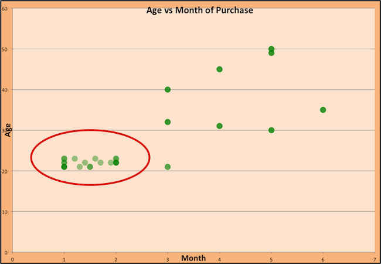

# Machine Learning

---

## What is machine learning?

----

### What is Machine learning?

Definition Candidates:

Arthur Samuel: *Field of study that gives computers the ability to learn without being explicitly programmed*

Tom Mitchell: *A computer program is said to learn from experience E with respect to some class of tasks T and performance measure P if its performance at tasks in T, as measured by P, improves with experience E.*

----

### What about artificial intelligence ?

- AIs
  - think and learn
  - mimmic human cognition

----

### Econometrics vs Machine Learning

- Econometrics is essentially a subfield of machine learning with a different jargon and a focus on:
  - studying properties and validity of results
      - data is scarce
      - inference
  - singling out effects of specific explanatory variables
  - establishing causality

- Machine learning:
  - structure data
  - make predictions (interpolate data)

---

## Big Data

----

### Data types

- structured:
    - tabular
      - long
      - wide
- unstructured:
    - files
    - networks
    - text, mails
    - images, sound

----

### Tabular Data

----

### Networks

- Banking networks
- Production network

----

### Big Data

- __Big__ data:
  - wide data (K>>N)
  - long data (N>>K)
  - heterogenous, unstructured data
- Might not even fit in memory
  - out of core computations
  - learn from a subset of the data

---

## Machine Learning Tasks

----

### Big subfields of Machine Learning

- Traditional classification
    - supervised (<mark>labelled</mark> data)
        - regression: predict quantity
        - classification: predict index (categorical variable)
    - unsupervised (no labels)
        - dimension reduction
        - clustering
    - semi-supervised / self-supervised
    - reinforcement learning
- Bazillions of different algorithms: https://scikit-learn.org/stable/user_guide.html

<table class="fragment current-visible">
<tr>
<th>Age</th>
<th>Activity</th>
<th><mark>Salary</mark></th>
</tr>
<tr>
<td>23</td>
<td>Explorer</td>
<td>1200</td>
</tr>
<tr>
<td>40</td>
<td>Mortician</td>
<td>2000</td>
</tr>
<tr>
<td>45</td>
<td>Mortician</td>
<td>2500</td>
</tr>
<tr>
<td>33</td>
<td>Movie Star</td>
<td>3000</td>
</tr>
<tr>
<td>35</td>
<td>Explorer</td>
<td>???</td>
</tr>
</table>

__supervised: regression__

- Predict: $y = f(x; \theta)$

<table class="fragment current-visible">
<tr>
<th>Age</th>
<th>Salary</th>
<th><mark>Activity</mark></th>
</tr>
<tr>
<td>23</td>
<td>1200</td>
<td>Explorer</td>
</tr>
<tr>
<td>40</td>
<td>2000</td>
<td>Mortician</td>
</tr>
<tr>
<td>45</td>
<td>2500</td>
<td>Mortician</td>
</tr>
<tr>
<td>33</td>
<td>3000</td>
<td>Movie Star</td>
</tr>
<tr>
<td>35</td>
<td>3000</td>
<td>???</td>
</tr>
</table>

__supervised: classification__

- Output is discrete
- Regular trick: $\sigma(f(x; \theta))$ where $\sigma(x)=\frac{1}{1-e^{-x}}$

<table class="fragment current-visible">
<tr>
<th>Age</th>
<th>Salary</th>
<th>Activity</th>
</tr>
<tr>
<td>23</td>
<td>1200</td>
<td>Explorer</td>
</tr>
<tr>
<td>40</td>
<td>2000</td>
<td>Mortician</td>
</tr>
<tr>
<td>45</td>
<td>2500</td>
<td>Mortician</td>
</tr>
<tr>
<td>33</td>
<td>3000</td>
<td>Movie Star</td>
</tr>
<tr>
<td>35</td>
<td>3000</td>
<td>Explorer</td>
</tr>
</table>

__unsupervised__

- organize data without labels
    - dimension reduction: describe data with less parameters
    - clustering: sort data into "similar groups" ([exemple](https://scikit-learn.org/stable/auto_examples/cluster/plot_cluster_comparison.html))

__unsupervised: clustering__

__unsupervised: clustering__

Women buying desses during the year:

----

## Difference with traditional regression

$$\underbrace{y}\_{\text{explained variable}} = a \underbrace{x}\_{\text{explanatory variable}} + b$$

| Econometrics                       |  Machine learning  | 
|------------------------------------|--------------------|
| Regressand / independent variable / explanatory variable  |  Features          | 
| Regressor / dependent variable / explained variable    |  Labels            |
| Regression                         |  Model Training    |

----

## Difference with traditional regression

- Big data requires other means to process the data:
    - data is long: so many observations $x$ doesn't fit in the memory
        - need to use incremental training method to use only a subsample at a time
    - data is wide: so many features, the model is crudely overspecified
        - need to build dimension reduction into the objective
    - data is nonlinear: 
        - use nonlinear model (and nonlinear training)
    - data is not a simple vector...
        - same as nonlinear

---

## Regression with long data

----

### Long data

- We've got *a lot* of data.
- Sometimes in doesn't fit in the computer memory so we can't run a basic regression
- Sometimes, we would like to update our model continuously:
  - incremental regression

----

### Long data
    
- Traditional regression:
    - full sample $X,Y=(x_i,y_i)_{i=1:N}$
    - OLS: $\min_{a,b} \sum_{i=1}^N (a x_i + b - y_i)^2$
    - closed-form solution: $a = X^{\prime}X Y$ and $b= ...$
    - hard to compute if $X$ is very big
- Incremental learning:
    - given initial $a_0$, $b_0$
    - pick $B$ random observations, regress them to get new estimate $a$, $b$
      - this minimizes the square of errors
    - update $a_1 \leftarrow a_0 (1-\beta) + \beta a $ where $\beta$ is a learning rate
    - process is not biased (that is $a$ converges to the true value) as long as one decreases $\beta$ sufficiently fast over time

----

### Formalisation

- parameter of unknowns: $\theta=(a,b)$
- dataset $X,Y=(x_i,y_i)_{i=1:N}$
- for a random draw $\omega = (a\_{\sigma(i)}, b\_{\sigma(i)})\_{i=[1,B]} \subset (X,Y)$
  - $\omega$ is just a random __batch__ of size $B$
- define the *empirical* risk (or empirical *cost*)
  $$\xi(\theta, \omega) = \sum_{(x,y) \in \omega} (y - (a x + b))^2$$
- we want to minimize *theoretical risk*:
  $$\Xi(\theta) = \mathbb{E} \left[ \xi(\theta, \omega)\right]$$

----

### Training: Gradient Descent

- How do we minimize a function $f(a,b)$?

- Gradient descent:
  - $a_k, b_k$ given
  - compute the gradient (slope) $\nabla_{a,b} f = \begin{bmatrix} \frac{\partial f}{\partial a} \\\\ \frac{\partial f}{\partial b}\end{bmatrix}$
  - follow the steepest slope: (Newton Algorithm)
    - $$ \begin{bmatrix} a_{k+1} \\\\ b_{k+1} \end{bmatrix} \leftarrow  \begin{bmatrix} a_k \\\\ b_k \end{bmatrix} - \nabla_{a,b} f$$
  - but not too fast: use learning rate $\lambda$:
   $$ \begin{bmatrix} a_{k+1} \\\\ b_{k+1} \end{bmatrix} \leftarrow  (1-\lambda) \begin{bmatrix} a_k \\\\ b_k \end{bmatrix} + \lambda (- \nabla_{a,b} f )$$

 

----

### Not everything goes wrong all the time

- In practice, choosing the right learning rate $\lambda$ is crucial
- $\lambda$ is a __metaparameter__ of the model training.

----

### Stochastic Gradient Descent

- Stochastic gradient descent
  - As long as the batch is taken randomly
  - As long as the learning rate is small enough
  - Or the batch size big enough
  - The gradient is *unbiased* (i.e. $\mathbb{E}\left[ \nabla \xi(\omega, \theta) \right] = \nabla \Xi(\theta)$)
- We don't need the whole dataset.

---

## Regression with wide data

----

## Wide data AI approach to Machine Learning

- Problem:
  - there are many independent variables $x_1, ... x_K$, $K>>N$ and one dependent variable.
  - $y = a_1 x_1 + a_2 x_2 + \cdots + a_N x_N + b$ is grossly overidentified.

- Idea: penalize non-zero coefficients to encourage scarcity
  - Ridge: $\Xi(a,b) = \min_{a,b} \sum_{i=1}^N ( \sum_j a_j x_j + b - y_i)^2 + \mu \sum_i |a_i|^2$
    - shrinks parameters towards zero
    - closed form
  - Lasso: $\Xi(a,b) = \min_{a,b} \sum_{i=1}^N (\sum_j a_j x_j + b - y_i)^2 + \mu \sum_i |a_i|$
    - eliminates zero coefficients
  - Elastic: Ridge + Lasso

- Remarks:
  - AI approach: minimize objective directly.
  - $\mu$ is called a regularization term.
    - $\mu \uparrow$, bias increases, variance decreases

----

### Training

- Lasso and ridge regression can be trained using Gradient Descent
- Or obtained using special algorithms

----

### Example: IMF challenge

- An internal IMF challenge to predict crises in countries
- Lots of different approaches
- Lots of data:
  - which one is relevant
  - machine must select relevant informations
- Example: *Lasso Regressions and Forecasting Models in Applied Stress Testing* by Jorge A. Chan-Lau
  - in a given developing country
  - tries to predict probability of default in various sectors

---

## Nonlinear Regression

----

### Nonlinear Regression

- So far, we have assumed, 
  - $y_i = a + b x_i$
  - $y_i = a + b x_i + μ_1 (a^2 + b^2) + μ_1 (|a| + |b|)$
  - defined $\Xi(a,b)$ and tried to minimize it
- Same approach works for fully nonlinear models
  - $y_i = a x_i + a^2 x_i^2 + c$
  - $y_i = \varphi(x; \theta)$ ()
- Special case: neural network:
  - primer [tensor playground](https://playground.tensorflow.org/#activation=tanh&batchSize=10&dataset=circle&regDataset=reg-plane&learningRate=0.03&regularizationRate=0&noise=0&networkShape=4,2&seed=0.85189&showTestData=false&discretize=false&percTrainData=50&x=true&y=true&xTimesY=false&xSquared=false&ySquared=false&cosX=false&sinX=false&cosY=false&sinY=false&collectStats=false&problem=classification&initZero=false&hideText=false)

---

## Model validation

----

## how to evaluate the machine learning

- Basic idea (independent of how complex the algorithm is)
  - separate data in
    - training set (in-sample)
    - test set (out of sample)
- train using only the training set
- evaluate performance on the test set
- Performance can be:
  - fitness, number of classification errors (false positive, false negative)
- In many traning parameters are used
  - training set (in-sample)
  - validation set (to update hyperparameters)
  - test set (out of sample)

Rule: the model and the hyperparameters should be chosen _independently from the test set_.

----

## How to judge a model validity?

- not easy
- modeling *asumptions* (specification):
    - functional space -> fit, variance (econ: $R^2$)
    - statistical modeling: data generating process -> bias (econ: stdev)
- There is a very general _tradeoff bias/variance_
- Many ML methods allow to estimate bias (possibly via bootstrapping)

----

---

<!-- 
### exemple: sentiment analysis

- Given a database of tweets (or Central Banks mpc declarations), build a measure of sentiment (positivity). How?
- Ask a human to provide measures of positiveness for tweets $y_i$
- Direct supervised approach: can we regress $y_i$ on the tweet contents? (each tweet is a vector of 280 characters).
    - Not a linear regression for sure, but maybe a neural network.
- Indirect approach:
    - First build a smaller vector representing a tweet  for instance word counts. (This is called feature extraction),
    - Regress sentiment on this smaller vector: yields positivity measure for many words.

----

### exemple 2: GANS

- Generative adversarial networks: impressive [deepfake](https://machinelearningmastery.com/impressive-applications-of-generative-adversarial-networks/) technology
- Trains two machine in turn
    - "generator" tries to fake data trying to fool the "discriminator"
        - produces $f(\epsilon, \theta)$ from a random vector $\epsilon$
        - gets feedback $P(f)$: an estimated probability 
        - tries to maximize $P$ by adjusting $\theta$
    - "discriminator": learns to recognize fake and true input. Is supervised by some human data.
    

----

## Reinforcement Learning

- Problem:
    - états: $s_t$
    - actions: $a_t$
    - reward: $r(s,a)$
    - random transitions (possibly unknown): $s_{t+1}=g(s_t,a_t,\epsilon_t)$
    - objective: $\max \sum_t \beta^t r_t$
- Method:
    - learn optimal policy $a_t=\pi(s_t; \theta)$ by trying random actions (goal is to find optimal $\theta$)
    - tradeoff between exploring (random wastes utility) and exploiting (with near-optimal decision) -->