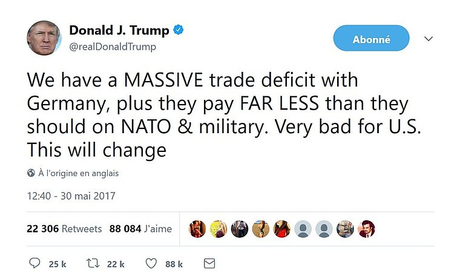
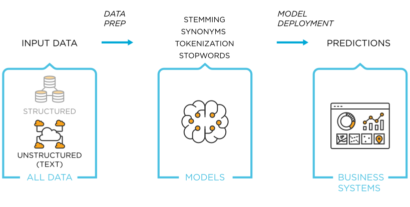

# Intro to text analysis

---

## What can we do?

----

### How to deal with text?


- Recall: big data contains *heterogenous* data
  - <mark>text</mark> / images / sound

----

### Example 1: FOMC meetings

*Taking the Fed at its Word: A New Approach to Estimating Central Bank Objectives using Text Analysis* by Adam H. Shapiro and Daniel J. Wilson [link](https://www.frbsf.org/economic-research/files/wp2019-02.pdf)

- Remember the Taylor rule? We tried to estimate it from the data.
- Generalized version: $i_t = \alpha_\pi (\pi_t-\pi^{\star}) + \alpha_y (y_t-y)$
- Is there a way to measure the preferences of the central bank? (coefficients and inflation target?)
- Shapiro and Wilson: let's look at the FOMC [meeting transcripts](https://www.federalreserve.gov/monetarypolicy/fomc_historical.htm)
- Excerpts (there are *tons* of them: 704,499)


<div class="r-stack">

<div class="fragment current-visible">

> I had several conversations at Jackson Hole with Wall Street economists and journalists, and they said, quite frankly, that they really do not believe that our effective inflation target is 1 to 2 percent. They believe we have morphed into 1+1/2 to 2+1/2 percent, and no one thought that we were really going to do anything over time to bring it down to 1 to 2.

Sep 2006 *St. Louis Federal Reserve President William Poole*

</div>

<div class="fragment current-visible">

> Like most of you, I am not at all alarmist about inflation. I think the worst that is likely to happen would be 20 or 30 basis points over the next year. But even that amount is a little disconcerting for me. I think it is very important for us to maintain our credibility on inflation and it would be somewhat expensive
to bring that additional inflation back down.

March 2006 *Chairman Ben Bernanke*

</div>

<div class="fragment current-visible">

> With inflation remaining at such rates, we could begin to lose credibility if
markets mistakenly inferred that our comfort zone had drifted higher. When we stop raising rates, we ought to be reasonably confident that policy is restrictive enough to bring inflation back toward the center of our comfort zone,
which I believe is 1+1/2 percent...So for today, we should move forward with an
increase of 25 basis points...

Jan 2006 *Chicago Federal Reserve President Michael Moskow*

</div>

</div>

- Machine learning task: evaluate the negativity of each comment

----

### Example 2



- Suppose you work in the trading floor of a financial instutition
- These kind of tweets have disturbing impact on the markets. You need to react quickly.
- You need a machine to assess the risk in real time.
- More generally, tweeter is a quite unique source of real-time data
- How do you analyse the content of the tweets?
- Comment: actually it's not only the content of the tweets, but who reads, who retweets: graph analyasis

----

### Text-mining: what can we extract from texts

- The main branches of text analysis are:
  - sentiment analysis
    - associate positivity/negativity to a text
    - precise meaning of "sentiment" is context dependent     
  - topic modeling
    - classify texts as belonging to known categories (supervised)
    - finding likely texts (unsupervised)
  - named-entity recognition
    - find who gets mentioned in the text
    - example: [A Cross-verified Database of Notable People, 3500BC-2018AD](https://portal.cepr.org/discussion-paper/17941)
  - event-extraction
    - recognize mention of events

----

### Clarification

- Text analysis / text mining are somewhat used interchangeably

- In general they consist in quantifying information used in a text...
- ... so that it can be incorporated in machine learning analysis
- Recently, *deep learning* (and [GPT-3](https://gpt3examples.com/#examples)) has changed this state of facts:
  - some models get trained direcly on text (intermediary phases are not explicited)

----

## The even-less glamorous part

- before getting started with text analysis, one needs to get hold of the text in the first place
- how to extract
  - webscraping: automate a bot to visit website and download text
  - document extraction: for instance extract the text from pdf docs, get rid of everything irrelevant
- how to store it
  - what kind of database?
  - important problem when database is big

---

## Transforming the text

----

### Processing steps

- Let's briefly see how text gets processed.
- Goal is to transform the text into a numerical vector of *features*
  - Stupid approach: "abc"->[1,2,3]
- All the steps can be done fairly easily with [nltk](https://www.nltk.org/)
  - nltk is comparable to sklearn in terms of widespread adoption

----

### Processing steps (2)

- Steps:
  - tokenization
  - stopwords
  - lexicon normalization
    - stemming
    - lemmatization
  - POS tagging

----

### Tokenization

<div  class="container">

<div class="col">

- Tokenization: split input into atomic elements.
- <!-- .element: class="fragment" data-fragment-index="2" --> We can recognize sentences.
- <!-- .element: class="fragment" data-fragment-index="3" --> Or words.
- <!-- .element: class="fragment" data-fragment-index="4" --> It is enough for some basic analysis:

<div class="fragment" data-fragment-index=4>

```python
from nltk.probability import FreqDist
fdist = FreqDist(words)
print(fdist.most_common(2))
```

```text
[('It', 1), ("'s", 1)]
```

</div>
</div>

<div class="col">

<div class="r-stack">

<div class="fragment" data-fragment-index=2>

```python
from nltk.tokenize import sent_tokenize
txt = """Animal Farm is a short novel by George Orwell. It was
written during World War II and published in 1945. It is about 
a group of farm animals who rebel against their farmer. They 
hope to create a place where the animals can be equal, free,
 and happy."""
sentences  = sent_tokenize(txt)
print(sentences)
```


```text
['Animal Farm is a short novel by George Orwell.',
 'It was\nwritten during World War II and published in 1945.', 
 'It is about \na group of farm animals who rebel against their farmer.', 
 'They \nhope to create a place where the animals can be equal, free,\n and happy.']
```

</div>

</div>

<div class="fragment"  data-fragment-index=3>

```python
from nltk.tokenize import word_tokenize
txt = "It's a beautiful thing, the destruction of words."
words  = word_tokenize(txt)
print(words)
```

```text
['It', "'s", 'a', 'beautiful', 'thing', ',', 'the', 'destruction', 'of', 'words', '.']
```

</div>

</div>


</div>

----

### Part-of speech tagging

<div class="container">

<div class="col">

- Sometimes we need information about the kind of tokens that we have
- <!-- .element: class="fragment" data-fragment-index="2" -->We can perform part-of-speech tagging (aka grammatical tagging)
- <!-- .element: class="fragment" data-fragment-index="3" -->This is useful to refine interpretation of some words
    - "it's not a beautiful thing"
    - vs "it's a beautiful thing"
    - *connotation* of beautiful changes

</div>


<div class="col">

<div class="fragment"  data-fragment-index=2>


```python
from nltk.tokenize import word_tokenize
tagged = nltk.pos_tag(words)
tagged
```

```text
[('It', 'PRP'),
 ("'s", 'VBZ'),
 ('a', 'DT'),
 ('beautiful', 'JJ'),
 ('thing', 'NN'),
 (',', ','),
 ('the', 'DT'),
 ('destruction', 'NN'),
 ('of', 'IN'),
 ('words', 'NNS'),
 ('.', '.')]
```

</div>

</div>
</div>


----

### Simplifying the text (1): stopwords

<div class="container">

<div class="col">

- Some words are very frequent and carry no useful meaning
  - <!-- .element: class="fragment" data-fragment-index="2" -->They are called *stopwords*
- <!-- .element: class="fragment" data-fragment-index="3" -->We typically remove them from our word list

</div>


<div class="col">

<div class="fragment"  data-fragment-index=2>

```python
from nltk.corpus import stopwords
stop_words=set(stopwords.words("english"))
print(stop_words)
```

```
{'their', 'then', 'not', 'ma', 'here', ...}

```

</div>

<div class="fragment"  data-fragment-index=3>

```python
filtered_words = [w for w in words if w not in stop_words]
filtered_words
```

```
['beautiful', 'thing' 'destruction', 'words']
```

</div>

</div>
</div>

----

### Simplifying the text (2): lexicon normalization

- Sometimes, there are several variants of a given word
  - tight, tightening, tighten
- Stemming: keeping the word root
- Lemmatization: keeps the word base
  - linguistically correct contrary to stemming

```python
from nltk.stem import PorterStemmer
ps = PorterStemmer()

words =  ["tight", "tightening", "tighten"]
stemmed_words=[ps.stem(w) for w in words]

```

```python
from nltk.stem.wordnet import WordNetLemmatizer
lem = WordNetLemmatizer()

words =  ["flying"]
stemmed_words=[ps.stem(w) for w in words]
lemmatized_words=[ps.stem(w) for w in words]
```

---

## Sentiment analysis

----

### Sentiment analysis

- What do we do now that we have reduced a text to a series of word occurrences?
- Two main approaches:
  1. lexical analysis
  2. machine learning

----

### Lexical analysis

Example:

$$\text{Sadly}\text{, there wasn't a glimpse of }\text{light} \text{ in his } \text{world } \text{ of intense }\text{suffering}$$

Total: -1+1-1. Sentiment is negative.

- Problems:
    - here, taking grammar into account would change everything
    - our dictionary doesn't have weights for what matters to us
  
$$ \text{the central bank forecasts increased }\underbrace{\text{inflation}}\_{?}$$

